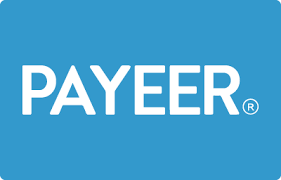

<h1 align="center">gmxch</h1>

---

  
my social

  
  
  
  
  
  

  
Public Repo

  - [PHP-BUILD](https://github.com/gmxch/php-build)

---

> **Note:** 89% VIBE-CODER lol 😎

## Game Experience
- PUBG
- BLOODSTRIKE
- COC

## Work Experience
- Buruh gulungan-benang
- Kuli proyek
- Helper welder

## Personal
- Height: 160+ cm
- Weight: 50+ kg

---

  
DONATE?

  
  <a href="https://www.paypal.com/">
    
    gamamoch@gmail.com
  </a>
  
  <a href="payeer.com">
    
    P1085631530
  </a>
  

---

> # README by gmxch
